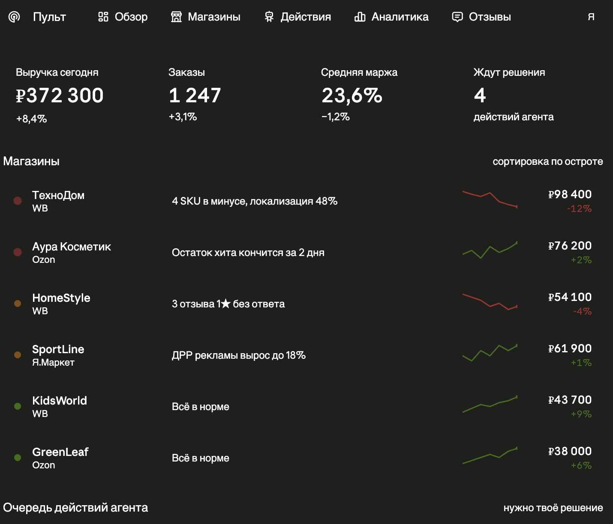
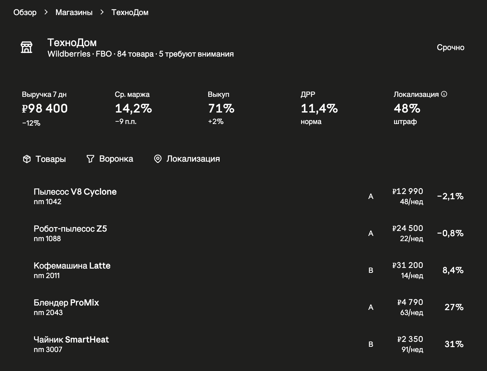
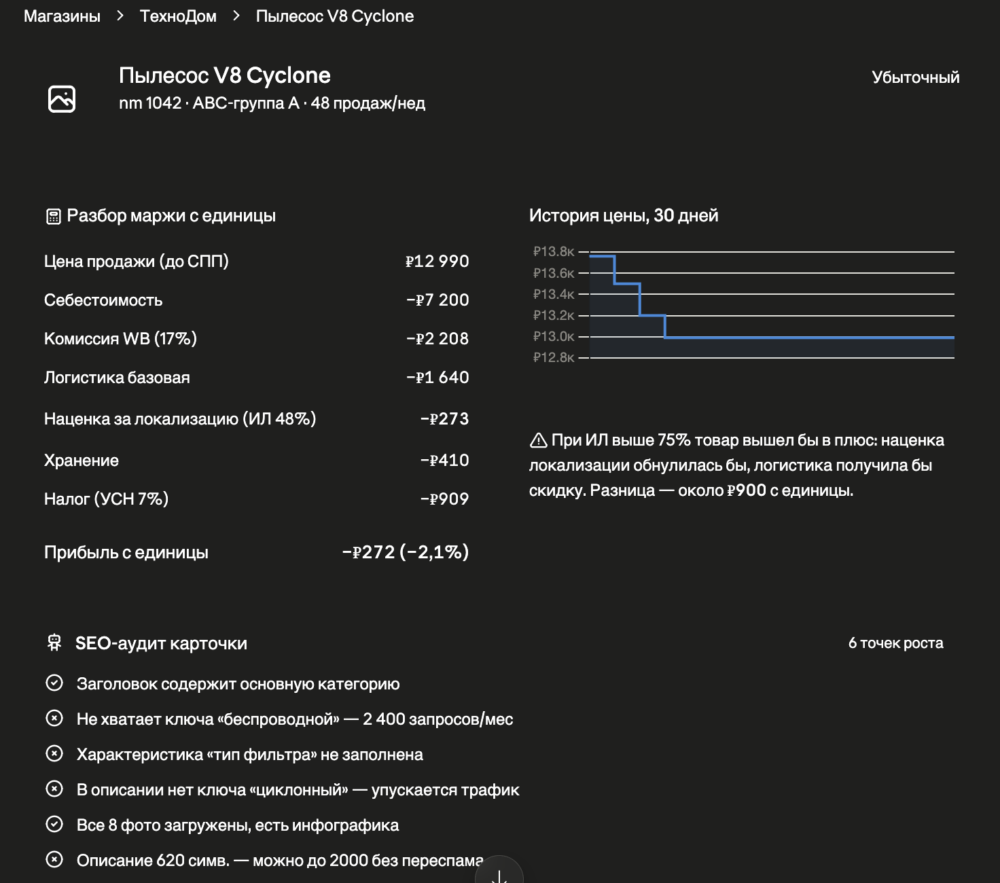
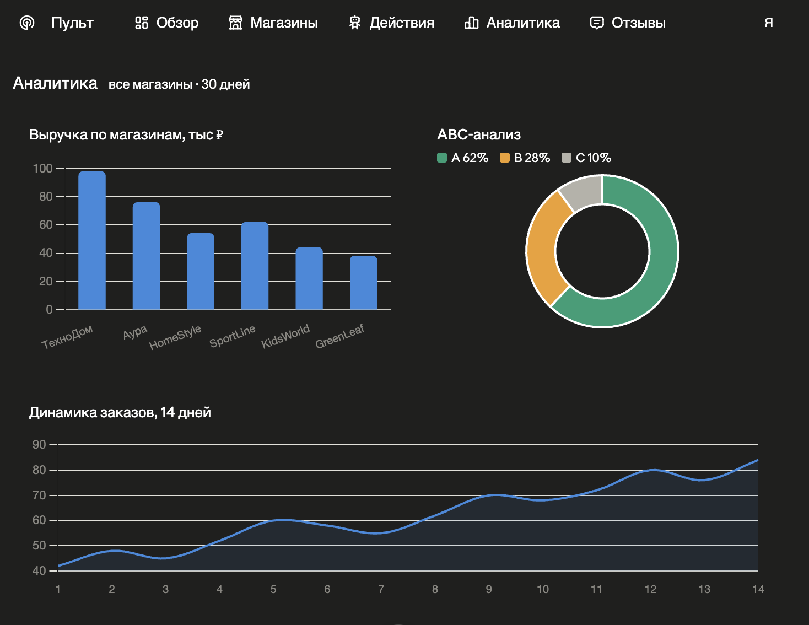
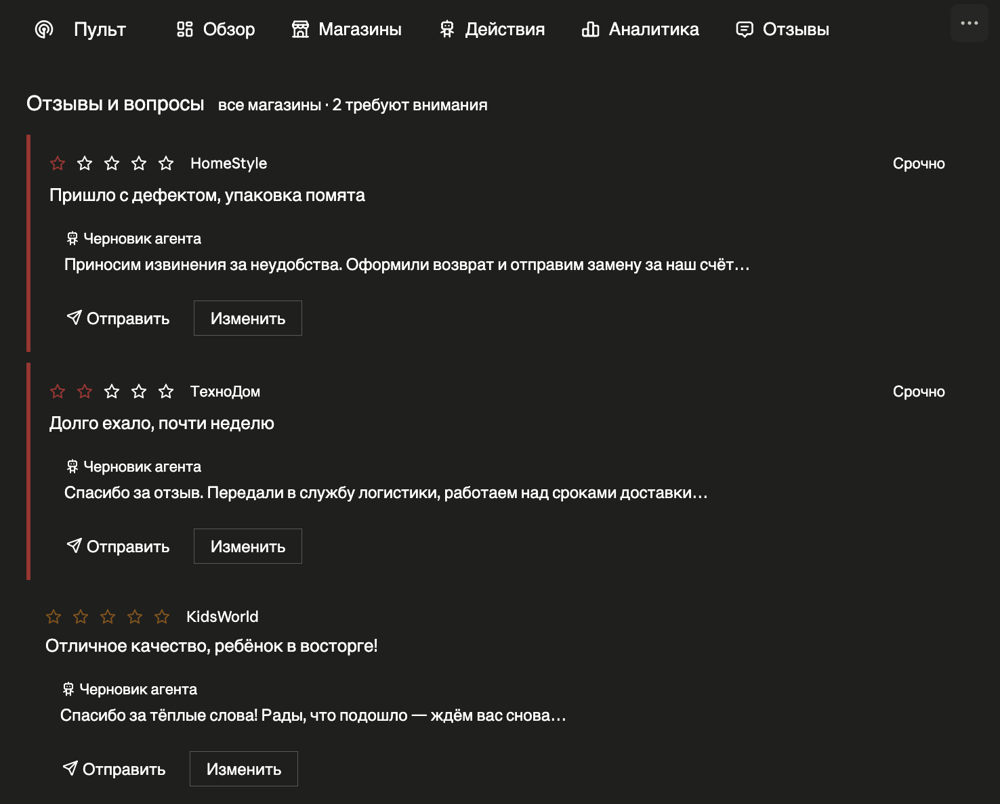
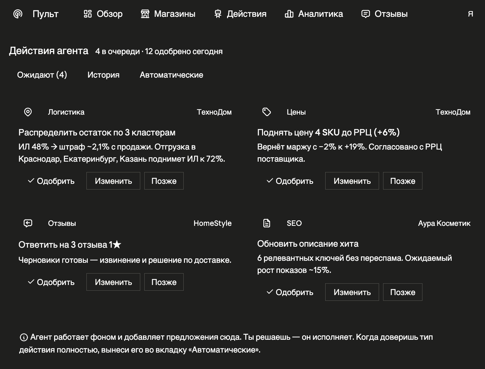

# AI-менеджер маркетплейсов

Интеллектуальная платформа для управления магазинами на маркетплейсах (Wildberries, Ozon,
Яндекс.Маркет) с AI-агентом, который ведёт аналитику, находит точки роста и предлагает
конкретные действия — а человек их подтверждает.

> **О репозитории.** Это витрина проекта: архитектура, интерфейс и подход. Исходный код не
> публикуется. Все данные на скриншотах — демонстрационные, названия магазинов вымышленные.

---

## Что это решает

Один менеджер, ведущий несколько магазинов на маркетплейсах, тонет в рутине: цены, остатки,
SEO карточек, отзывы, реклама, юнит-экономика — и всё это по каждому кабинету отдельно, руками,
в разных личных кабинетах. Платформа собирает все магазины в один «командный центр», а
AI-агент берёт на себя аналитику и черновую работу, оставляя человеку только решения.

Ключевой принцип: **агент предлагает — человек подтверждает.** Ни одно действие (изменение
цены, ответ на отзыв, обновление карточки) не уходит в реальный кабинет без подтверждения.
Автономия включается постепенно, по мере доверия к каждому типу действий.

---

## Возможности

- **Мультитенантность.** Много организаций → много кабинетов разных площадок в одном интерфейсе,
  с изоляцией данных и шифрованным хранением API-ключей.
- **Аналитика.** Юнит-экономика (комиссия, логистика, хранение, налог, индекс локализации),
  ABC-анализ, воронка продаж, сверка «прогноз vs факт» по фактическим финансовым отчётам.
- **SEO и карточки.** Аудит карточек, генерация непереспамленных релевантных описаний,
  выявление слабых мест и точек роста.
- **Отзывы.** Единая лента отзывов и вопросов со всех магазинов, черновики ответов от агента,
  приоритизация негатива.
- **Финансы.** P&L по магазину и товару с учётом всех удержаний, штрафов, эквайринга;
  справочная оценка налога (УСН 6% / 15% на уровне организации).
- **Индекс локализации.** Расчёт влияния локализации на логистику, карта спроса по регионам,
  рекомендации по распределению остатков.
- **Движок действий.** Единый механизм «предложение → подтверждение → исполнение → журнал»
  с полным логом (критично при управлении чужими деньгами).

---

## Интерфейс

Десктоп-first, с адаптивом под мобильный. Переключение светлой и тёмной темы. Акцент на
плотную информативность и скорость: оператор с одного экрана видит, где что «горит», и решает
в один клик.

<!--
СКРИНШОТЫ: вставь сюда изображения. Как получить — см. раздел «Как обновить скриншоты» внизу.
Рекомендуемый порядок и подписи ниже. Замени пути на реальные файлы в папке /screenshots.
-->

### Главный экран — командный центр
Операторские счётчики (что требует решения, магазины в красной зоне, горящие остатки,
убыточные SKU), список магазинов с трендами и очередь предложений агента.



### Карточка магазина
Пульс метрик, воронка продаж, индекс локализации с картой спроса по кластерам, блок
«что требует внимания» и список товаров.



### Карточка товара
Галерея фото, SEO-поля, аудит от агента, разбор маржи с учётом локализации, история цены.



### Аналитика
Сквозные отчёты по всем магазинам: выручка, ABC-анализ, динамика заказов.



### Отзывы
AI-менеджер сам пишет ответы на отзывы



### Действия
AI-менеджер сам предлагает различные действия, обновить цену, переписать описания, распределить товары по другим складам и ид



---

## Архитектура (верхнеуровнево)

Система построена слоями — от интеграций с площадками до AI поверх нормализованных данных.

```
┌─────────────────────────────────────────────┐
│              Веб-интерфейс (React)            │
│   Обзор · Магазины · Действия · Аналитика     │
└───────────────────────┬───────────────────────┘
                        │
┌───────────────────────┴───────────────────────┐
│                 Backend (FastAPI)              │
│                                                │
│  ┌──────────────┐  ┌────────────────────────┐  │
│  │  AI-агент    │  │  Детерминированные      │  │
│  │ (tool-calling)│─▶│  калькуляторы          │  │
│  │              │  │  (юнит-эк., ABC,        │  │
│  │ интерпретация│  │   воронка, P&L)         │  │
│  └──────────────┘  └────────────────────────┘  │
│         │                                      │
│  ┌──────┴───────────────────────────────────┐  │
│  │  Движок действий (human-in-the-loop)      │  │
│  │  предложение → подтверждение → лог        │  │
│  └───────────────────────────────────────────┘  │
│                                                │
│  ┌───────────────────────────────────────────┐  │
│  │  Коннекторы маркетплейсов                  │  │
│  │  (нормализация, лимиты, изоляция ошибок)   │  │
│  └───────────────────────────────────────────┘  │
└───────────────────────┬───────────────────────┘
                        │
              ┌─────────┴─────────┐
              │   PostgreSQL       │
              │  (мультитенантность│
              │   + история)       │
              └────────────────────┘
                        │
        ┌───────────────┼───────────────┐
     Wildberries      Ozon        Яндекс.Маркет
```

### Ключевые инженерные решения

- **Числа считает код, а не LLM.** Вся арифметика (маржа, ABC, налоги, P&L) — детерминированные
  калькуляторы, покрытые тестами. Агент только интерпретирует готовые цифры и формулирует
  рекомендации. Это исключает «выдуманные» цифры в отчётах о чужих деньгах.
- **Действия — только через движок подтверждений.** Никаких прямых вызовов API на запись в
  обход единого механизма с логом. Это и безопасность, и основа доверия.
- **Устойчивость к реальности API.** Коннекторы переживают лимиты, пагинацию, «осиротевшие»
  данные, недокументированное поведение и внезапное отключение методов — с изоляцией ошибок
  по каждой сущности, чтобы сбой одного отчёта не ронял всю синхронизацию.
- **Абстракция источника данных.** Логика аналитики не зависит от того, откуда данные —
  живой API, сохранённый снимок или тестовый набор.

---

## Технологический стек

| Слой | Технологии |
|---|---|
| Backend | Python, FastAPI, SQLAlchemy, Alembic |
| База данных | PostgreSQL |
| Frontend | React, TypeScript, Tailwind |
| AI | LLM с tool-calling (агент как оркестратор инструментов) |
| Интеграции | REST API маркетплейсов (Wildberries, Ozon, Яндекс.Маркет) |

---

## Статус

Проект в активной разработке. Реализовано: мультитенантная платформа, коннектор Wildberries
(чтение и запись), калькуляторы юнит-экономики / ABC / воронки, AI-агент для SEO, аудита
карточек, отчётов и ответов на отзывы, движок подтверждения действий, аналитика рекламы,
финансовые отчёты. В работе: P&L и сверка «прогноз vs факт», масштабирование на Ozon и
Яндекс.Маркет.

---

